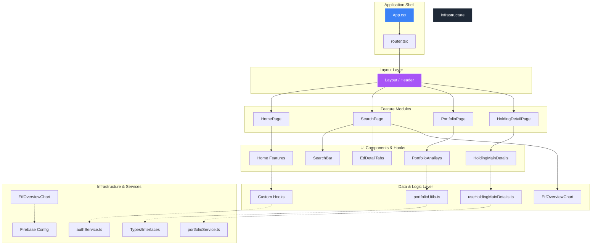

# Architecture Overview

Questo documento descrive l'architettura di alto livello dell'applicazione, focalizzandosi sul flusso dei dati e sulla struttura modulare del frontend.

## Data Flow: Firebase to UI
Il flusso dei dati segue un modello unidirezionale basato su **State Management** e **Hooks**:

1.  **Data Source (Firebase):** I dati grezzi vengono recuperati dai servizi di database/autenticazione tramite il layer `services/`.
2.  **Service Layer:** Ogni funzionalità (es. `authService`, `portfolioService`) espone funzioni asincrone che gestiscono la logica di business e la comunicazione con Firebase.
3.  **Custom Hooks (`use...`):** I componenti non chiamano direttamente i servizi. Invece, utilizzano Hook personalizzati (es. `useHoldingFinancialDetails`) che gestiscono lo stato locale (loading, error, data) e semplificano l'interfaccia per la UI.
4.  **UI Components:** I componenti ricevono i dati tramite le proprietà o dai hook e gestiscono il rendering della vista.
5.  **Context API:** Per i dati globali (Auth, Portfolio), il flusso passa attraverso i Context Provider che iniettano lo stato in tutta l'applicazione.

## Component Hierarchy & Dependencies

Di seguito è riportata la gerarchia delle dipendenze e della struttura dei componenti:

## Design Principles
- **Separation of Concerns:** La logica di calcolo (es. `portfolioUtils`) è separata dalla logica di stato dei componenti.
- **Type Safety:** Ogni dato che fluisce tra i livelli deve essere rigorosamente tipizzato tramite `interfaces` o `types`.
- **Modularity:** Le feature sono organizzate in cartelle indipendenti all'interno della directory `features/` per facilitare la scalabilità.